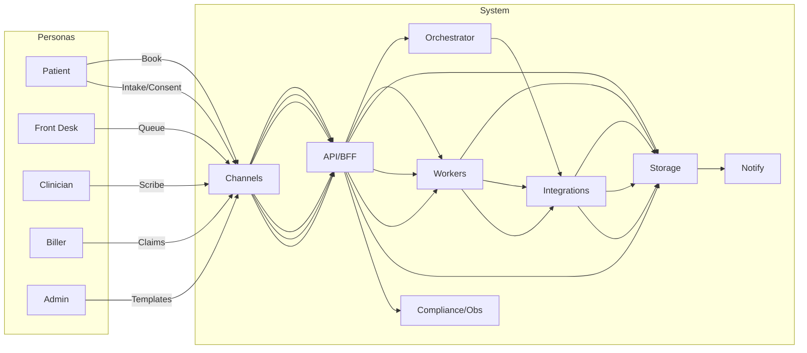

```mermaid
flowchart LR
    subgraph Personas
      A[Patient]; B[Front Desk]; C[Clinician]; D[Biller]; E[Admin]
    end
    subgraph System
      S1[Channels]; S2[API/BFF]; S3[Orchestrator]; S4[Integrations]; S5[Workers]; S6[Storage]; S7[Notify]; S8[Compliance/Obs]
    end
    A -->|Book| S1 --> S2 --> S3 --> S4 --> S6 --> S7
    A -->|Intake/Consent| S1 --> S2 --> S5 --> S6
    B -->|Queue| S1 --> S2 --> S6
    C -->|Scribe| S1 --> S2 --> S5 --> S4 --> S6
    D -->|Claims| S1 --> S2 --> S5 --> S4 --> S6
    E -->|Templates| S1 --> S2 --> S6
    S2 --> S8
```
